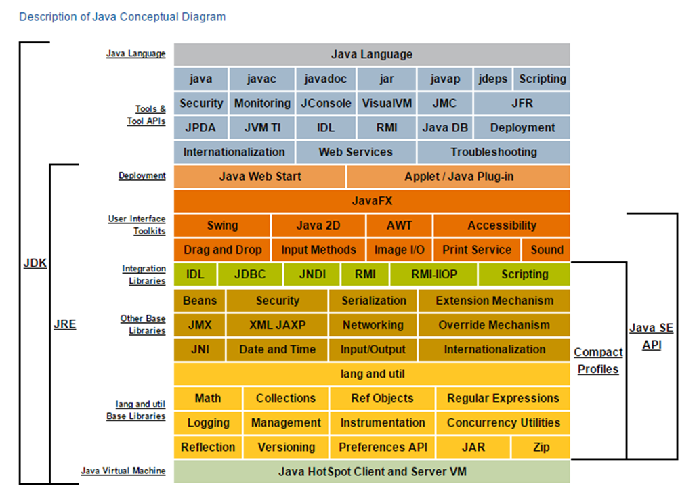

# Java VS. Java

#### This is small research for checking the various ways to use Java to achieve the same result which is the best ? what is preferable ?

In this modern world there are various ways to do the exact same thing, you can use programing languages to develop different applications, algorithms, etc.
While researching on the subject we came a cross few researches which did a benchmarking test between Java and C language, and it is not hard to guess which will perform better but still, it curios to find by how much, also since Kotlin came to replace Java at Android app development we also found a comparison between these two, and this is interesting since one came to replace another, the result from the paper were – “ The differences are in fact usually not very substantial, however, a common trend of Kotlin always being out-performed by Java is observed, even if that is not by a very big factor in the vast majority of benchmarks “
When comparing two different programing languages, you will choose the best and most efficient way to implement the program in each language, and the result will decide which programing language will win in this contest.
But how you will know you chose the best approach to implement this ?

We are trying to figure out what is the best approach to do something since there are various ways of doing it.

Over the years since Java was released in May 1995, a lot of changes and features has been adding to it, stays the same in the aspect of high-level and object-oriented and run on the Java Virtual Machine (JVM).

There are currently 18 Java versions and, a new version is scheduled for every 6 months , we decided to start our testing from Java 8 since legacy project companies still using Java 8 or actually stuck with it.
There are 3 Long Term Support (LTS) Java versions, and the main focus will be on them.	- Java 8, 11, 17.
Each version come with a set of features some are an addition to tool set and some come to replace existing methods, we list some of the features but definitely not all and we are do not intend to, since it is out of scope for this paper.
You can read about the new features that each version is adding to the Java language, since the JDK is a superset of the JRE that have inside it the JRE some versions mostly updating the JVM and the garbage collector (GC), we will not cover these changes.
We will check the performance of “doing the same thing just in a different way”, on the different versions of Java. Also check the same code on different versions of Java Development Kit (JDK) and Java Runtime Environment (JRE).

**Java In Details** 

`JRE:`
It is a package of everything necessary to run a complied Java program, including the Java Virtual Machine (JVM), the Java Class Library, the java command, and other infrastructure.
However, it cannot be used to create new programs.
`JDK:`
The JDK is the full-featured SDK (Software Development Kit) for Java.
It has everything the JRE has, but also the compiler (javac) and tools (like javadoc and jdb).
It is capable of creating and compiling programs.

>
**This project is using YourKit**

YourKit supports open source projects with innovative and intelligent tools for monitoring and profiling Java and .NET applications.
YourKit is the creator of <a href="https://www.yourkit.com/java/profiler/">YourKit Java Profiler</a>, <a href="https://www.yourkit.com/.net/profiler/">YourKit .NET Profiler</a>, and <a href="https://www.yourkit.com/youmonitor/">YourKit YouMonitor</a>.

>
